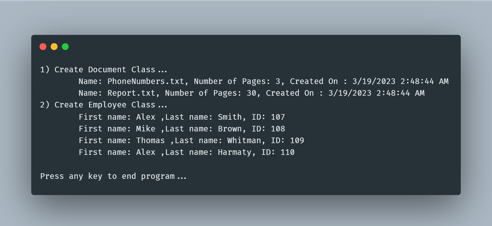

# Classes & ToString

(FSC-BCS-426-Lab2)

## Output

## Assignment Context

This project was one of the first assignments for my C# Programming class. 

The goal of this assignment was for students to further explore C#, so we were prompted to generate specified objects with random data and print them using a ToString override.

This was a solo assignment made with C#, ASP.NET, and Visual Studio 2022.

## How It Works

My program defines two classes, "Document" and "Employee", and uses them in the "Main" method of the "Program" class.

### "Document" Class

The "Document" class has three private fields: "name", "numberOfPages", and "createdOn". 

It has a constructor that takes two arguments, "newName" and "newNum", and initializes the fields "name" and "numberOfPages" with these values. 

It also initializes the "createdOn" field with the current date and time using the "DateTime.Now" method.

The class also overrides the "ToString" method to return a string representation of a "Document" object that includes the values of its fields.

### "Employee" Class

The "Employee" class has three fields: "firstName", "lastName", and "iD". 

The "iD" field is marked as "readonly", meaning it can only be set once in the constructor. 

The class also has a "static" field "nextAvailableID" that is incremented every time a new "Employee" object is created. 

The class has a static constructor that initializes the "nextAvailableID" field with a random value between 1 and 9999.

The "Employee" class also overrides the "ToString" method to return a string representation of an "Employee" object that includes the values of its fields.

### "Main" Class

The "Main" method of the "Program" class creates two "Document" objects and four "Employee" objects using their respective constructors, and then prints out their string representations using the "Console.WriteLine" and "ToString" methods.

The code also includes a commented-out line that attempts to change the value of the "createdOn" field of a "Document" object, but this is only to show why it fails as the "createdOn" field is marked "readonly".

Finally, the code waits for the user to input any key to end the program.
